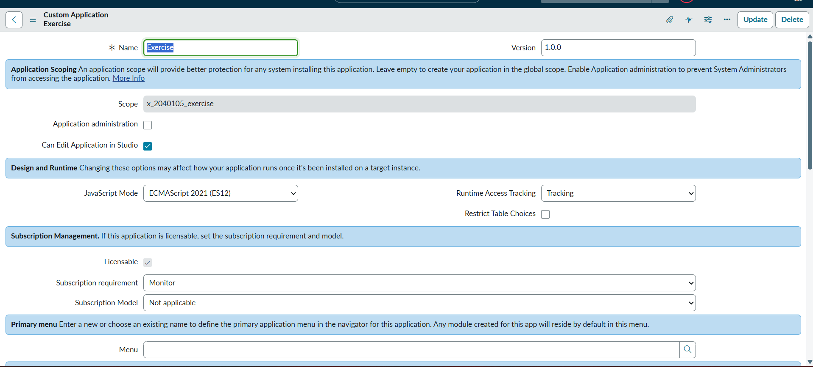
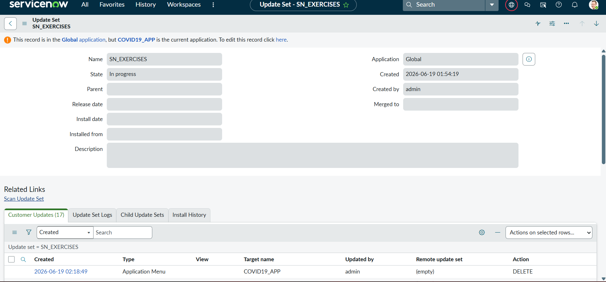
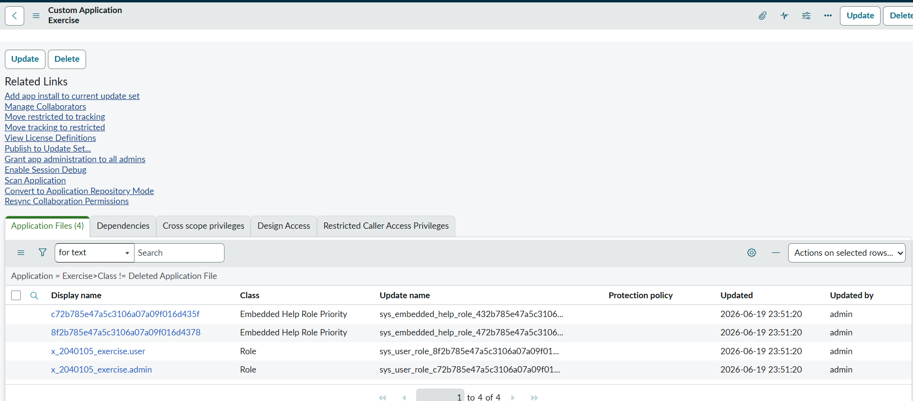
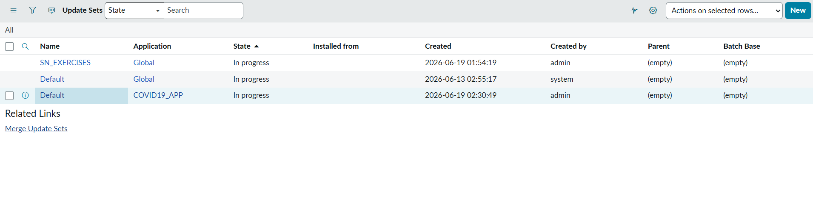

# AI-Powered IT Helpdesk & ServiceNow Integration

An intelligent IT Helpdesk ticket classification and resolution suggestion system integrated with **ServiceNow**. This project uses **FastAPI** to serve a prediction endpoint, **Google Gemini 2.5 Flash** (via the Google GenAI SDK) to analyze tickets, and **ServiceNow Business Rules & REST Messages** to automate ticket routing, priority classification, and resolution generation.



---

## 🚀 Key Features

*   **Automated Ticket Analysis**: Classifies incoming IT issues into appropriate categories (*Network*, *Hardware*, *Security*, *Software*).
*   **Intelligent Priority Mapping**: Evaluates the severity and impact to assign a priority (*Low*, *Medium*, *High*, *Critical*).
*   **Smart Routing (Assignment Groups)**: Routes the ticket to the correct group (*Network Team*, *Hardware Team*, *Security Team*, *Software Team*, *IT Support*).
*   **AI-Generated Solutions**: Recommends a quick, actionable 1-2 sentence solution to the assignee/user automatically.
*   **ServiceNow Dashboard**: A Platform Analytics dashboard visualizing ticket priorities, categories, and assignment groups in real-time.

---

## 🛠️ Tech Stack

### Backend
*   **Python 3.x**
*   **FastAPI**: High-performance web framework for APIs.
*   **Uvicorn**: ASGI web server.
*   **Google GenAI SDK**: Integrates the `gemini-2.5-flash` model for high-speed ticket reasoning and analysis.
*   **ngrok / Render**: Used to host/tunnel the backend endpoint so ServiceNow can securely communicate with it.

### ServiceNow Integration
*   **Business Rules**: Triggered on Incident insert/update to trigger the REST message payload.
*   **REST Messages**: ServiceNow outbound integrations sending request bodies to the FastAPI endpoints.
*   **Platform Analytics**: Interactive reports (bar charts, pie charts) showing ticket distribution metrics.

---

## 📂 Project Structure

```text
AI-Help-Desk/
├── Backend/
│   ├── AI_classifier.py     # Gemini client logic & prompting
│   ├── main.py              # FastAPI server & route handlers
│   ├── Requirements.txt     # Python dependencies
│   ├── .env                 # API keys and local secrets (ignored by git)
│   └── .gitignore           # Exclusions for venv, cache, and env variables
└── README.md                # Project documentation
```

---

## ⚙️ Backend Installation & Setup

### 1. Clone & Set Up Virtual Environment
Navigate to the `Backend` directory:
```bash
cd Backend
python -m venv venv
```
Activate the virtual environment:
*   **Windows (PowerShell)**:
    ```powershell
    .\venv\Scripts\Activate.ps1
    ```
*   **macOS / Linux**:
    ```bash
    source venv/bin/activate
    ```

### 2. Install Dependencies
```bash
pip install -r Requirements.txt
```

### 3. Configure Environment Variables
Create a `.env` file inside the `Backend/` folder:
```env
GEMINI_API_KEY=your_gemini_api_key_here
```

### 4. Run the Development Server
```bash
uvicorn main:app --reload --port 8000
```
The server will start at `http://127.0.0.1:8000`. You can access the API documentation at `http://127.0.0.1:8000/docs`.

---

## 🔌 Connecting to ServiceNow

To connect your local server to ServiceNow, use **ngrok** to create a public URL:
```bash
ngrok http 8000
```
Copy the generated public forwarding URL (e.g., `https://xxxx-xx.ngrok-free.app`).

### 1. ServiceNow REST Message Setup
1. In ServiceNow, navigate to **System Web Services > Outbound > REST Messages**.
2. Click **New** and name it `AI Analyzer`.
3. Set the Endpoint to your Render deployment URL or your ngrok forwarding address, ending with the `/analyze` route:
   ```text
   https://<your-ngrok-or-render-url>/analyze
   ```
4. Create a **HTTP Method** named `post`.
5. Define the HTTP Request content body to accept a JSON payload:
   ```json
   {
     "short_description": "${short_description}",
     "description": "${description}"
   }
   ```



### 2. ServiceNow Business Rule Setup
To automatically run the AI classifier when incidents are created or updated, set up a **Business Rule**:
1. Navigate to **System Definition > Business Rules**.
2. Create a new rule named `AI Ticket Analyzer` on the **Incident [incident]** table.
3. Check the **Active** and **Advanced** boxes.
4. Set the trigger conditions (e.g., **When: async** or **after**, **Insert: true**, **Update: true**).
5. In the **Advanced** tab, write a script to invoke the REST Message:

```javascript
(function executeRule(current, previous /*null when async*/) {
    try {
        var r = new sn_ws.RESTMessageV2('AI Analyzer', 'post');
        r.setStringParameterNoEscape('short_description', current.short_description.toString());
        r.setStringParameterNoEscape('description', current.description.toString());
        
        r.setHttpTimeout(60000);
        var response = r.execute();
        var responseBody = response.getBody();
        var httpStatus = response.getStatusCode();
        
        if (httpStatus === 200) {
            var result = JSON.parse(responseBody);
            
            // Map return parameters to ServiceNow incident fields
            current.category = result.category; 
            current.priority = mapPriorityToServiceNow(result.priority);
            current.assignment_group.setDisplayValue(result.assignment_group);
            current.close_notes = "AI Solution: " + result.solution;
            current.update();
        }
        
        gs.info('AI Analyzer HTTP Status: ' + httpStatus);
    } catch (ex) {
        var message = ex.message;
        gs.error('AI Ticket Analyzer execution failed: ' + message);
    }
})(current, previous);
```



---

## 📊 Analytics Dashboard

In ServiceNow, you can set up a **Platform Analytics Dashboard** (`AI Helpdesk Dashboard`) to track:
1. **Incidents by Priority**: Horizontal or vertical bar chart analyzing critical versus planning-state incidents.
2. **Assignment Group Allocation**: Pie charts depicting the load across the *Network Team*, *Software Team*, *Hardware Team*, and *Security Team*.
3. **Category Breakdown**: Grouping and measuring incidents by their category automatically populated by the Gemini API.


