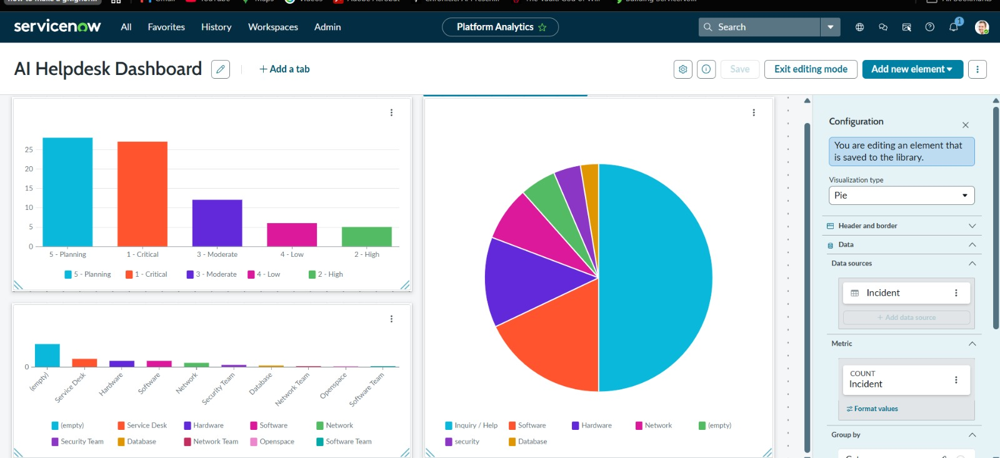
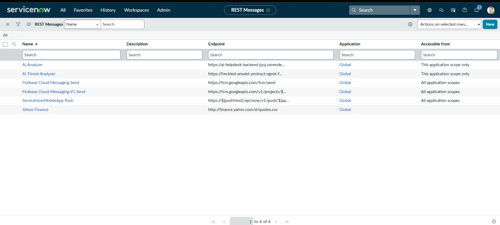
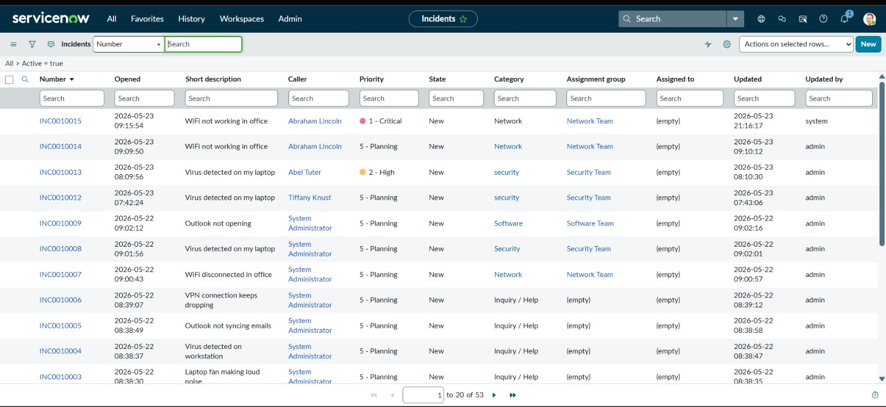
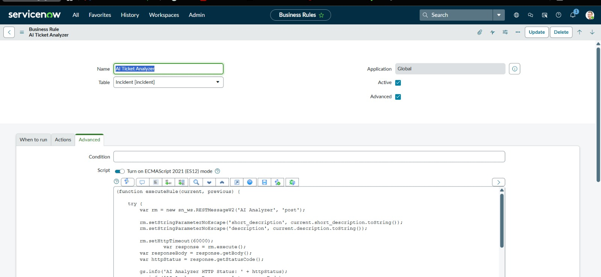

# AI Help Desk 

An intelligent IT support ticket classification system powered by FastAPI and Google's Gemini AI (`gemini-2.5-flash`). This application automatically analyzes, categorizes, prioritizes, assigns, and suggests troubleshooting solutions for incoming IT support tickets.

---

## Features

- **Automated Classification**: Automatically tags tickets into one of the key categories: `Network`, `Hardware`, `Security`, or `Software`.
- **Smart Prioritization**: Dynamically determines urgency levels: `Low`, `Medium`, `High`, or `Critical`.
- **Intelligent Routing**: Routes tickets to the appropriate resolver group: `Network Team`, `Hardware Team`, `Security Team`, `Software Team`, or `IT Support`.
- **AI-Powered Solutions**: Generates a brief, actionable solution (1-2 sentences) to assist support agents.
- **FastAPI Core**: Highly performant, async-first API endpoints with automatic interactive OpenAPI documentation.

---

##  Technology Stack

- **Framework**: [FastAPI](https://fastapi.tiangolo.com/) (Python)
- **AI Engine**: [Google Gemini 2.5 Flash](https://ai.google.dev/) via the modern `google-genai` SDK
- **Environment Management**: `python-dotenv`
- **Data Validation**: `pydantic`
- **Deployment Utility**: `uvicorn` (ASGI server) & Ngrok (for local tunneling)

---

##  Screenshots

Here are screenshots showing the FastAPI application status, interactive Swagger documentation, and ticket analysis API usage:

### 1. API Running Status


### 2. Interactive API Documentation (Swagger UI)


### 3. Ticket Analysis API Request and Response


### 4. Additional System Logs and Execution Verification


---

##  Setup & Installation

### 1. Prerequisites
Ensure you have **Python 3.10+** installed on your system.

### 2. Clone and Navigate
Navigate to the project root directory:
```bash
cd "AI help desk"
```

### 3. Create a Virtual Environment
Initialize and activate a virtual environment:
```bash
# Windows
python -m venv Backend/venv
Backend\Scripts\activate

# macOS/Linux
python3 -m venv Backend/venv
source Backend/venv/bin/activate
```

### 4. Install Dependencies
Install the required packages:
```bash
pip install -r Backend/Requirements.txt
```

### 5. Environment Configuration
Create a `.env` file in the `Backend` directory and define your Google Gemini API Key:
```env
GEMINI_API_KEY=your_gemini_api_key_here
```

---

##  Running the Application

Start the FastAPI local development server using `uvicorn`:

```bash
cd Backend
uvicorn main:app --reload
```

The API will be available at: `http://127.0.0.1:8000`
Interactive documentation (Swagger UI): `http://127.0.0.1:8000/docs`

---

##  API Reference

### 1. Health Check
* **Endpoint**: `GET /`
* **Description**: Verifies if the backend is running.
* **Response**:
  ```json
  {
    "status": "AI Helpdesk backend is running"
  }
  ```

### 2. Analyze Ticket
* **Endpoint**: `POST /analyze`
* **Description**: Analyzes the short description and detailed description of a support ticket.
* **Request Body**:
  ```json
  {
    "short_description": "Cannot connect to office Wi-Fi",
    "description": "My laptop shows 'No Internet Secured' when connecting to the office Wi-Fi network. Other devices seem to work fine."
  }
  ```
* **Response**:
  ```json
  {
    "category": "Network",
    "priority": "Medium",
    "assignment_group": "Network Team",
    "solution": "Forget the office Wi-Fi network in your system network settings, restart your network adapter, and reconnect by re-entering your credentials."
  }
  ```

---


